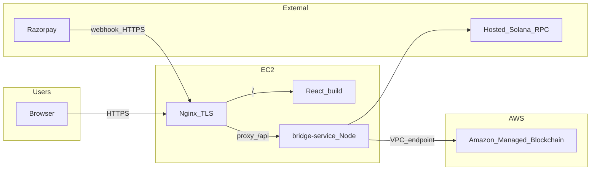

# Host Nivix on AWS (AMB + single EC2)

## Target architecture

- **Fabric**: Peers/orderer service live in **AMB** (not on your EC2).
- **EC2**: **nginx** serves the React `**build/`** and **reverse-proxies** API traffic to **bridge-service** (`[nivix-project/bridge-service/package.json](nivix-project/bridge-service/package.json)` → `node src/index.js`, default `PORT` 3002 in `[index.js](nivix-project/bridge-service/src/index.js)`).
- **bridge** → AMB using `**FABRIC_MODE=gateway`** and paths from `[nivix-project/bridge-service/config/fabric-gateway.env.example](nivix-project/bridge-service/config/fabric-gateway.env.example)`; implementation in `[fabric-gateway-client.js](nivix-project/bridge-service/src/fabric-gateway-client.js)`.

## Phase 1 — Amazon Managed Blockchain (blockchain layer)

1. Same **AWS region** for AMB, VPC, and EC2.
2. Follow the official sequence: [Get started tutorial](https://docs.aws.amazon.com/managed-blockchain/latest/hyperledger-fabric-dev/managed-blockchain-get-started-tutorial.html): **network** → **member** → **VPC endpoint/association** → **peer nodes** (production: **2 peers**, **LevelDB**, **bc.m5.large** or larger) → **client enroll** → **channel** → **chaincode lifecycle** for `**nivix-kyc`** from `[nivix-project/fabric-samples/test-network/chaincode-nivix-kyc/](nivix-project/fabric-samples/test-network/chaincode-nivix-kyc/)` (channel/chaincode names must match `FABRIC_CHANNEL` / `FABRIC_CHAINCODE`).
3. Export **connection profile JSON** and **filesystem wallet** (app identity) to use only on the bridge host (later store in **Secrets Manager** and materialize at runtime).

## Phase 2 — VPC and EC2

Phase 2 — VPC and EC2

1. **VPC** with subnets that satisfy AMB endpoint requirements; EC2 in a subnet with **route to AMB** (and **NAT** or egress path if the instance is private, for `npm`/updates).
2. **Security groups**: inbound **443** (and **80** redirect) from the internet; **SSH** restricted or replaced by **SSM Session Manager**; **no** inbound Fabric ports from `0.0.0.0/0`.
3. Choose instance size for **Node + nginx** (e.g. **t3.medium** starter; scale with load).

## Phase 3 — bridge-service on EC2

1. Install **Node.js LTS**; deploy `[nivix-project/bridge-service/](nivix-project/bridge-service/)` (`npm ci --omit=dev`, `npm start` or **systemd** unit with `WorkingDirectory` and env file).
2. Set production env: **Razorpay**, **Solana RPC**, `**PORT=3002`** (or internal port), `**NODE_ENV=production`**, and Fabric gateway vars (`FABRIC_MODE=gateway`, `FABRIC_CONNECTION_PROFILE_PATH`, `FABRIC_WALLET_PATH`, `FABRIC_WALLET_USER`, `FABRIC_CHANNEL`, `FABRIC_CHAINCODE`, `FABRIC_DISCOVERY_AS_LOCALHOST=false`).
3. Verify `**curl http://127.0.0.1:3002/health`** on the instance.
4. **CORS**: ensure `[cors()](nivix-project/bridge-service/src/index.js)` allows your public **[https://yourdomain](https://yourdomain)** origin if the browser ever calls the API on a different host (same-origin via nginx avoids most CORS issues).

## Phase 4 — React build and nginx

1. Build from `[nivix-project/frontend/nivix-pay-old/](nivix-project/frontend/nivix-pay-old/)` with `**REACT_APP_BRIDGE_URL=https://yourdomain.com`** (same origin you expose; no trailing slash, matching existing pattern in e.g. `[AmountPaymentForm.tsx](nivix-project/frontend/nivix-pay-old/src/components/forms/AmountPaymentForm.tsx)`).
2. Deploy `**build/`** to e.g. `/var/www/nivix/html`.
3. **nginx**: `location /` → static files; `location /api/` (and `**/health`** if you want external health checks) → `proxy_pass http://127.0.0.1:3002` with standard headers (`Host`, `X-Forwarded-For`, `X-Forwarded-Proto`). Align paths so `/api/...` reaches Express routes unchanged.

## Phase 5 — TLS, DNS, webhooks

1. **DNS** A/AAAA to EC2 (or ALB if you add one later).
2. **TLS**: **Let’s Encrypt (certbot)** on EC2, or terminate TLS on **ALB** (optional second component).
3. **Razorpay** webhook URL: public `https://yourdomain.com/...` path that maps to the bridge’s webhook route (confirm exact path in bridge routes).
4. **WebSocket gap**: `[websocketService.ts](nivix-project/frontend/nivix-pay-old/src/services/websocketService.ts)` and `[ProcessingStatus.tsx](nivix-project/frontend/nivix-pay-old/src/components/processing/ProcessingStatus.tsx)` use `**ws://localhost:3002`**. For production, plan a **configurable `REACT_APP_BRIDGE_WS_URL`** (e.g. `wss://yourdomain.com`) and **nginx `proxy_pass` for `/status/`** with **WebSocket upgrade** headers, or disable WS until implemented.
5. **KYCAdmin hardcoded API**: `[KYCAdmin.tsx](nivix-project/frontend/nivix-pay-old/src/pages/KYCAdmin.tsx)` calls `**http://localhost:3002`** directly — switch to `**REACT_APP_BRIDGE_URL`** (or relative `/api`) so admin works in production.

## Phase 6 — Operations and later upgrades

1. **Secrets**: migrate from flat `.env` on disk to **AWS Secrets Manager** + systemd `**EnvironmentFile`** or entry script.
2. **Logs**: **CloudWatch agent** or ship journald/nginx logs.
3. **Backups**: EBS snapshots for instance; **RDS** later for data currently in JSON files (`[getDatabaseConfig](nivix-project/bridge-service/src/config/production-config.js)`) when you move off file storage.
4. **Scaling path**: move static site to **S3 + CloudFront** and/or run bridge on **ECS Fargate** behind **ALB**; AMB network unchanged.

## Dependency order (short)

AMB healthy + chaincode committed → VPC/EC2 + endpoint → bridge env + local health → nginx + TLS → production build with `**REACT_APP_BRIDGE_URL`** → fix **WS + KYCAdmin** URLs → Razorpay webhook test → harden secrets and monitoring.