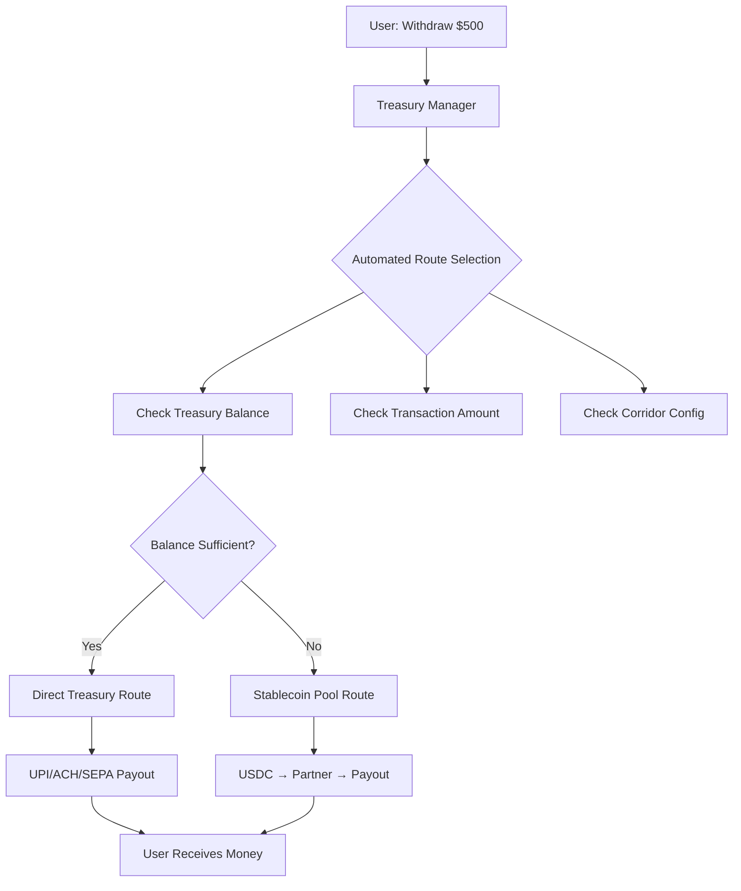

# 🤖 Nivix Automated Off-ramp Routing System

## Overview

The Nivix off-ramp system features **completely automated routing** with **zero user interface**. Users simply click "Withdraw" and the system intelligently chooses the optimal payout route based on real-time conditions.

## ✅ User Experience

```
User clicks: "Withdraw $500 to my bank account"
    ↓
System automatically:
✅ Checks treasury balance
✅ Analyzes transaction amount  
✅ Selects optimal route
✅ Processes payout
✅ Notifies user of completion
    ↓
User receives money (doesn't know which route was used)
```

## 🎯 Intelligent Routing Logic

### Route Selection Algorithm

The system automatically chooses between two routes:

1. **Direct Treasury Route** (Faster, Cheaper)
   - Direct payout from pre-funded local bank account
   - Used for: UPI (India), domestic transfers
   - Speed: Instant to 30 minutes
   - Cost: Lower fees

2. **Stablecoin Pool Route** (Cross-border)
   - Convert to USDC → Partner converts to fiat → Partner pays user
   - Used for: International transfers, low treasury balance
   - Speed: 1-3 business days
   - Cost: Higher fees but more flexible

### Automated Decision Rules

```javascript
// Rule 1: Treasury Balance Check
if (treasuryBalance - withdrawalAmount >= minimumThreshold) {
    route = "direct"  // Fast local payout
} else {
    route = "hybrid"  // Stablecoin route
}

// Rule 2: Amount Optimization  
if (smallAmount && highTreasuryBalance) {
    route = "direct"  // Use treasury for speed
}

// Rule 3: Corridor Defaults
India (INR) → Default: Direct (UPI/IMPS)
USA (USD) → Default: Hybrid (ACH via partner)  
Europe (EUR) → Default: Hybrid (SEPA via partner)
```

## 📊 Configuration Examples

### India Corridor (INR)
```json
{
  "route": "direct",
  "fallbackRoute": "hybrid",
  "paymentMethods": ["UPI", "IMPS", "NEFT"],
  "processingTime": "instant-30min",
  "thresholds": {
    "min": 50000,     // Keep ₹50K minimum
    "target": 500000   // Target ₹5L balance
  }
}
```

**Routing Logic:**
- ✅ Treasury has ₹2L, user withdraws ₹10K → **Direct UPI** (instant)
- ⚠️ Treasury has ₹40K, user withdraws ₹30K → **Hybrid route** (stablecoin)

### USA Corridor (USD)
```json
{
  "route": "hybrid", 
  "fallbackRoute": "direct",
  "paymentMethods": ["ACH", "Wire"],
  "processingTime": "1-3 business days"
}
```

**Routing Logic:**
- ✅ Default → **Hybrid route** (USDC → Partner → ACH)
- 🚀 Small amount + high balance → **Direct** (faster)

## 🔧 System Architecture



## 📈 Real-world Examples

### Example 1: India Small Amount
```
User: Withdraw ₹5,000
Treasury Balance: ₹800,000
Decision: Direct UPI route
Reason: Sufficient balance, small amount, instant delivery
Time: 30 seconds
Fees: ₹25 platform + ₹5 UPI = ₹30 total
```

### Example 2: India Large Amount, Low Balance  
```
User: Withdraw ₹150,000
Treasury Balance: ₹80,000  
Decision: Stablecoin pool route
Reason: Treasury balance insufficient (80K - 150K < 50K minimum)
Time: 2-4 hours
Fees: Higher due to USDC conversion + partner fees
```

### Example 3: USA Standard Transfer
```
User: Withdraw $1,000
Treasury Balance: $5,000
Decision: Hybrid route (default for USA)
Reason: Default corridor configuration
Time: 1-2 business days
Fees: USDC conversion + partner ACH fees
```

## ⚡ Benefits of Automated Routing

### For Users:
- ✅ **Simple UX**: Just click "Withdraw" 
- ✅ **Optimal Speed**: System picks fastest available route
- ✅ **Best Pricing**: Automatic cost optimization
- ✅ **No Confusion**: No complex route selection UI

### For Business:
- ✅ **Treasury Optimization**: Maintains minimum balances automatically
- ✅ **Cost Control**: Routes to cheapest option when possible  
- ✅ **Risk Management**: Prevents treasury depletion
- ✅ **Scalability**: Handles any volume automatically

### For Operations:
- ✅ **Self-healing**: Automatic fallbacks when systems fail
- ✅ **Load Balancing**: Distributes traffic across routes
- ✅ **Monitoring**: Full audit trail of routing decisions
- ✅ **Alerts**: Automatic warnings for rebalancing needs

## 🚨 Monitoring & Alerts

### Automated Alerts:
```
⚠️ INR Treasury Low: ₹45,000 (below ₹50,000 minimum)
→ Action: Switch to hybrid route, trigger rebalancing

🔄 Auto-rebalancing triggered: Converting $10K USDC to ₹8.3L INR
→ Action: Restore direct route capability

📊 High volume detected: 500 transactions/hour  
→ Action: Load balance between direct and hybrid routes
```

## 🔍 Route Selection Transparency

While users don't see the routing decision, the system maintains full transparency:

```json
{
  "transactionId": "tx_abc123",
  "routeUsed": "direct",
  "routeReason": "Direct treasury payout - sufficient balance (800000 >= 155000)",
  "processingTime": "30 seconds",
  "fees": {
    "platform": 25,
    "payment": 5,
    "total": 30
  }
}
```

## 🎉 Result: Perfect User Experience

```
❌ OLD SYSTEM:
"Choose payout method: [ ] Direct Treasury [ ] Stablecoin Pool"
→ User confused, picks wrong option, pays more fees

✅ NEW SYSTEM:  
"Withdraw ₹10,000" → [WITHDRAW BUTTON]
→ System automatically picks optimal route
→ User gets money fast and cheap
```

The automated routing system ensures users always get the **best possible experience** without any complexity or decision-making burden.


