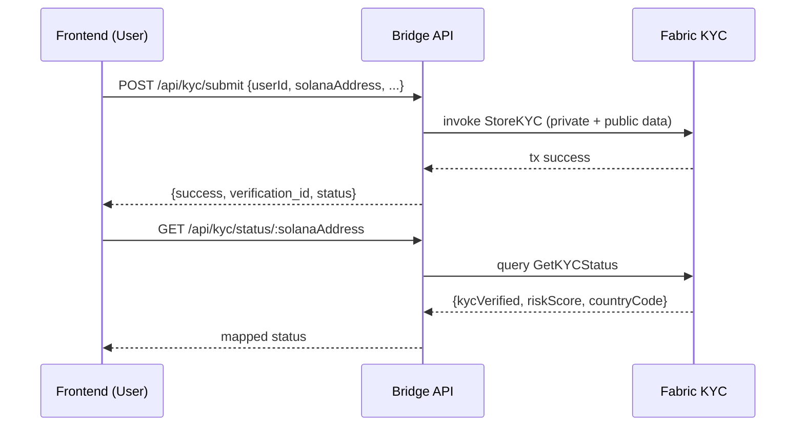
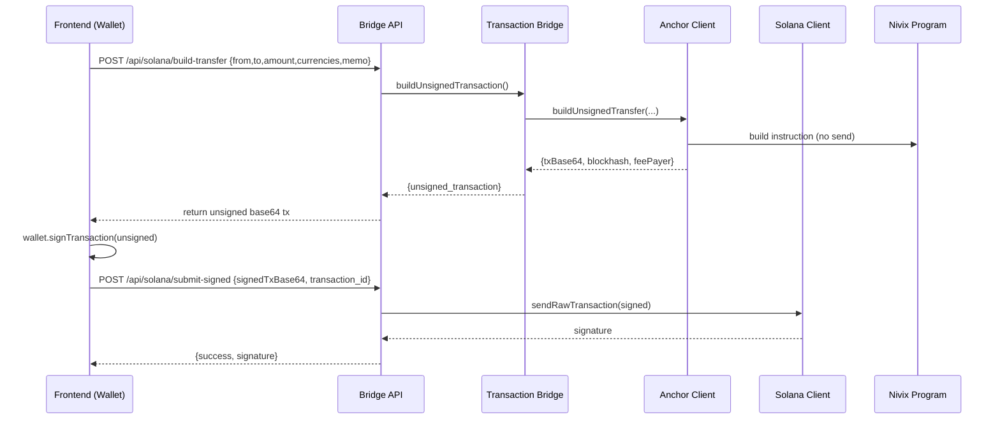

### Nivix Protocol — Technical Overview

This document equips new developers to work on Nivix: architecture, auth model, component flows, APIs, Solana and Hyperledger integration, and on/off-ramp processes.

## 1) System Architecture

```mermaid
graph LR
  subgraph Frontend [Frontend (React + TS)]
    UI[Wallet UI\nKYC\nSend/Swap\nHistory]
  end

  subgraph Bridge [Bridge Service (Node.js/Express)]
    API[/REST API/]
    SC[Solana Client]
    AC[Anchor Client]
    TB[Transaction Bridge]
    FQ[Fabric Query/Invoke]
  end

  subgraph Solana [Solana]
    SP[Anchor Program\n`nivix_protocol`]
    TP[SPL Token Program]
  end

  subgraph Fabric [Hyperledger Fabric]
    KYC[Chaincode: nivix-kyc]
    PD[Private Data Collection]
  end

  UI -->|HTTPS| API
  API --> SC
  API --> AC
  API --> TB
  TB -->|record/query| FQ
  SC -->|mint/ATA/submit tx| TP
  AC -->|program RPC| SP
  FQ --> KYC
```

## 2) Authentication and Identity Model

- Wallet-based auth (non-custodial): Users authenticate by signing transactions with their Solana wallet. No email/password.
- Bridge auth: Bridge does not custody user keys; it only constructs unsigned transactions and relays signed transactions.
- Fabric identity: The bridge invokes Fabric chaincode through scripts/peer identities managed server-side; users are referenced by their Solana address.
- KYC linkage: KYC records in Fabric map `userId` and `solanaAddress` and carry `riskScore` and `countryCode`.

Implications
- Authoritative identity on Solana = the public key that signs transactions.
- Compliance state is read from Fabric before certain operations (e.g., transfers) when available.

## 3) Components and Key Files

- Bridge service (Node): `nivix-project/bridge-service/`
  - Entry/API: `src/index.js`
  - Solana low-level client: `src/solana/solana-client.js`
  - Anchor client: `src/solana/anchor-client.js`
  - Cross-chain orchestration: `src/bridge/transaction-bridge.js`
  - Fabric helpers: `src/direct-invoke.js`, `src/direct-kyc.js`, `/tmp/fabric-invoke.sh` (runtime symlink/copy)

- Frontend (React): `nivix-project/frontend/nivix-pay/`
  - API service: `src/services/apiService.ts`
  - Pages: `src/pages/KYC.tsx`, `src/pages/Send.tsx`, `src/pages/Dashboard.tsx`, etc.

- Solana program (Anchor): `nivix-project/solana/nivix_protocol/`
  - Program logic: `programs/nivix_protocol/src/lib.rs`
  - IDL/config: `Anchor.toml`, `migrations/deploy.ts`, `config/nivix_protocol.json` (copied to bridge)

- Hyperledger Fabric (KYC): `nivix-project/hyperledger/`
  - Chaincode: `chaincode/nivix-kyc/`
  - Deployment scripts: `deploy-nivix-kyc.sh`, `fabric-samples/test-network/...`

## 4) High-Level Flows

### 4.1 KYC Flow



### 4.2 User-Signed Transfer Flow (Solana)



### 4.3 On-Ramp and Off-Ramp

On-Ramp (fiat → token)
- Treasury/PSP receives fiat → bridge mints corresponding stable/fiat-rep token to user ATA via `@solana/spl-token`.
- Recorded on Fabric for audit.

Off-Ramp (token → fiat)
- User initiates payout → bridge burns tokens from user ATA or treasury-side netting.
- Bridge routes payout via Local Treasury or PSP partner; payout recorded on Fabric.

```mermaid
flowchart LR
  A[User tokens] -->|Burn| B[Bridge/Treasury]
  B --> C{Router}
  C -->|Local| D[Bank transfer (local treasury)]
  C -->|PSP| E[PSP payout]
  B --> F[Fabric Record]
```

## 5) API Endpoints (Bridge Service)

KYC
- POST `/api/kyc/submit` → submit KYC record to Fabric
- GET `/api/kyc/status/:solanaAddress` → fetch KYC status

Solana
- GET `/api/solana/balance/:address` → SOL balance
- POST `/api/solana/airdrop` → devnet airdrop SOL
- POST `/api/solana/create-mint` → create SPL mint (dev)
- POST `/api/solana/mint-to` → mint tokens to owner ATA
- POST `/api/solana/get-or-create-ata` → ensure ATA exists
- POST `/api/solana/build-transfer` → unsigned tx for user signing
- POST `/api/solana/submit-signed` → submit signed tx (base64)
- GET `/api/solana/bridge-wallet` → bridge wallet public key

Bridge Transactions
- POST `/api/bridge/initiate-transfer` → aliases to build unsigned transfer
- GET `/api/bridge/transaction-status/:id` → status of a tx
- GET `/api/bridge/wallet-transactions/:address` → txs for a wallet
- POST `/api/bridge/sync-offline-transaction` → placeholder for offline sync

Fabric (direct)
- POST `/api/fabric/query` → query chaincode (fcn,args)
- POST `/api/fabric/invoke` → invoke chaincode (fcn,args)

Planned (Phase Next)
- GET `/api/pools` | GET `/api/pools/:id`
- POST `/api/swap` (unsigned)
- POST `/api/offramp/initiate` | GET `/api/offramp/status/:id`

## 6) Solana Program (Anchor) — `nivix_protocol`

Accounts/Concepts
- Platform: fee rate, total fees, configuration
- User: owner, KYC metadata (risk_score, country_code)
- Wallet: currency-scoped balances per user (program-derived)
- LiquidityPool: currency pair, pool fee, volume, timestamps
- SwapRecord: swap tracking with ids and rates

Key Instructions (selection)
- `initialize_platform(fee_rate)`
- `register_user(risk_score,country_code,...)` (validates ranges)
- `process_transfer(...)` applies platform fees, records transaction id
- `record_offline_transaction(...)` risk-based limits
- `create_liquidity_pool(...)`, `add_liquidity(...)`, `update_pool_rate(...)`
- `swap_currencies(...)` creates `SwapRecord`

Token Operations
- We follow Solana SPL Token Program patterns for mints, ATAs, and minting as documented by Solana Foundation (see "Create Tokens with the Token Program") [reference](https://solana.com/developers/courses/tokens-and-nfts/token-program#make-some-token-metadata).

## 7) Hyperledger Fabric — KYC Chaincode

Highlights
- Public state: minimal pointer/status by `solanaAddress`
- Private data collection: full KYC record keyed by `userId`
- Functions include: `StoreKYC`, `GetKYCStatus`, `UpdateKYCRisk`, `QueryAllKYC`

Deployment
- Use `deploy-nivix-kyc.sh` (adds `GOFLAGS=-buildvcs=false` during package)
- Network comes from Fabric samples `test-network`

## 8) Data and Compliance

- All user-facing transfers are user-signed on Solana; bridge never holds private keys.
- KYC gating: `TransactionBridge.verifyKYC` checks status when Fabric is reachable.
- Audit trail: Transactions and payouts recorded to Fabric where applicable.

## 9) Configuration & Environment

- `SOLANA_RPC_URL` → Solana RPC endpoint (e.g., `http://127.0.0.1:8899` or devnet)
- Bridge wallet file: `bridge-service/wallet/bridge-wallet.json`
- Anchor Program ID: `FavSaLC...Ztavbw` configured in Anchor client and Anchor.toml

## 10) Developer Runbook

Local bring-up
1. Start Fabric network (test-network) and deploy `nivix-kyc` chaincode.
2. Ensure `/tmp/fabric-invoke.sh` exists and is executable (helper or symlink).
3. Start Solana validator (local) or use devnet and set `SOLANA_RPC_URL`.
4. Start Bridge: `node src/index.js` in `bridge-service`.
5. Start Frontend: `npm start` in `frontend/nivix-pay`.

Smoke tests
- GET `/health`
- POST `/api/kyc/submit` → then GET `/api/kyc/status/:address`
- POST `/api/solana/create-mint` → POST `/api/solana/mint-to`
- POST `/api/solana/build-transfer` → wallet signs → POST `/api/solana/submit-signed`

## 11) Roadmap (delta to complete)

- Currency registry and static mints (USDC, INR, EUR) wired into program/bridge
- Pool creation and initial seeding (USDC/INR, USDC/EUR)
- Swap endpoints + frontend Swap UI
- Off-ramp router (Local/PSP), burn-and-payout + Fabric record
- Portfolio/LP positions + history UI
- Tests: unit/integration/E2E; deployment docs

## 12) References

- Solana SPL Token Program overview and examples: [Solana Foundation — Create Tokens With the Token Program](https://solana.com/developers/courses/tokens-and-nfts/token-program#make-some-token-metadata)

## 13) Fabric Identity and Enrollment

- Admin enrollment utilities live under `bridge-service/src/enrollAdmin.js` (and similar helpers if present like `registerUser.js`). These scripts handle enrolling admin identities against the Fabric CA and placing credentials in the expected wallet/keystore for chaincode access.
- Operational note: The current bridge primarily uses a helper script `/tmp/fabric-invoke.sh` for chaincode calls. Ensure the script is present and executable, and that peer/org credentials are correctly configured.

## 14) Environment Variables

- `PORT`: Bridge HTTP port (default 3002)
- `SOLANA_RPC_URL`: Solana RPC endpoint (e.g., `http://127.0.0.1:8899` or `https://api.devnet.solana.com`)
- Additional Fabric-related environment variables may be used by helper scripts; align with your network setup (CORE_PEER_*, FABRIC_CFG_PATH, etc.) if you move off the helper script.

## 15) Observability and Logging

- Request logging: Implemented middleware logs method, URL, body, and response duration in `bridge-service/src/index.js`.
- KYC log: `bridge-service/kyc-submissions.log` appends each submission.
- Transactions persistence: `bridge-service/data/transactions/transactions.json` stores pending/completed records.
- Health check: `GET /health` exposes feature flags and versions.

## 16) Data and Storage Locations

- Bridge wallet keypair: `bridge-service/wallet/bridge-wallet.json`
- Transaction log (JSON): `bridge-service/data/transactions/transactions.json`
- KYC submission log: `bridge-service/kyc-submissions.log`
- IDL cache (when fetched): `bridge-service/config/nivix_protocol.json`

## 17) Error Handling and Retry Policies

- KYC submission: `storeKYCData` performs up to 3 retries to submit to Fabric; on failure it stores data in memory and file storage, logs the event, and schedules a delayed retry. Response indicates pending state.
- Solana submission: raw signed transactions are submitted with confirmation; errors are propagated back to callers with message text.
- Hyperledger connectivity: bridge attempts a query on startup and on-demand; failures do not crash the service but degrade to limited functionality.

## 18) Frontend Wallet Integration Notes

- The send flow is wallet-signed. The frontend requests an unsigned tx from the bridge, signs it with `wallet.signTransaction`, and submits the base64 via `/api/solana/submit-signed`.
- Ensure the connected wallet has recent blockhash compatibility and enough SOL for fees (devnet airdrop helper is available).
- For SPL tokens, ensure the recipient’s ATA exists (`/api/solana/get-or-create-ata`) before mint/transfer operations.

## 19) Security Considerations

- Non-custodial: Bridge never holds user private keys. Only the bridge’s own operational keypair is stored locally for mint authority and admin tasks; keep `bridge-service/wallet/bridge-wallet.json` restricted.
- Fabric invoke surface: `/tmp/fabric-invoke.sh` must be treated as sensitive; validate inputs to `/api/fabric/invoke` and `/api/fabric/query` and restrict exposure in production.
- CORS: Review and lock down origins before production.
- Secrets: Avoid committing any private keys; use environment-specific secret management.

## 20) Known Inconsistencies / Action Items

- Solana Program ID consistency: `anchor-client.js` uses `FavSaLCcw6qgpLob47uGPoNhJRsGjBMB1tSb7CZTavbw` while `solana-client.js` still references `this.programId = new PublicKey('6WapLzAB...');` which is unused but misleading. Align or remove the stale field to prevent confusion.
- Planned endpoints: `/api/pools`, `/api/swap`, and `/api/offramp/*` are documented as planned; implement and wire to frontend.
- Currency registry: Register USDC/INR/EUR in the program and ensure bridge mappings for mints/decimals are configured.

## Project Description

Nivix Protocol is a Solana‑first, hybrid cross‑border payments platform. It combines non‑custodial, wallet‑signed SPL token transactions with a Hyperledger Fabric KYC and audit layer, enabling compliant, low‑latency value transfer across currencies. Liquidity pools (e.g., USDC/INR, USDC/EUR) power swaps and pricing, while dual off‑ramp rails (local treasury or PSP partners) convert tokens to fiat. The bridge service orchestrates flows between frontend, Solana programs, SPL token operations, and Fabric chaincode—without ever holding user keys.


